<h3>
  > 👋 Hey!, I am <b><a target="_blank" href="#">HugManh</a></b>
</h3>

  I’m a curious soul who loves exploring new ideas, traveling to hidden places, and sipping on refreshing herbal tea while daydreaming about the universe.

  <table>
    <tbody>
      <tr>
        <td align="center"> 
          <h6>Websites/PWAs</h6>
          
        </td>
        <td align="center">   
          <h6>Cloud Services</h6>
          
        </td>
        <td align="center">
          <h6>Others</h6>
          
        </td>
      </tr>
    </tbody>
  </table>

